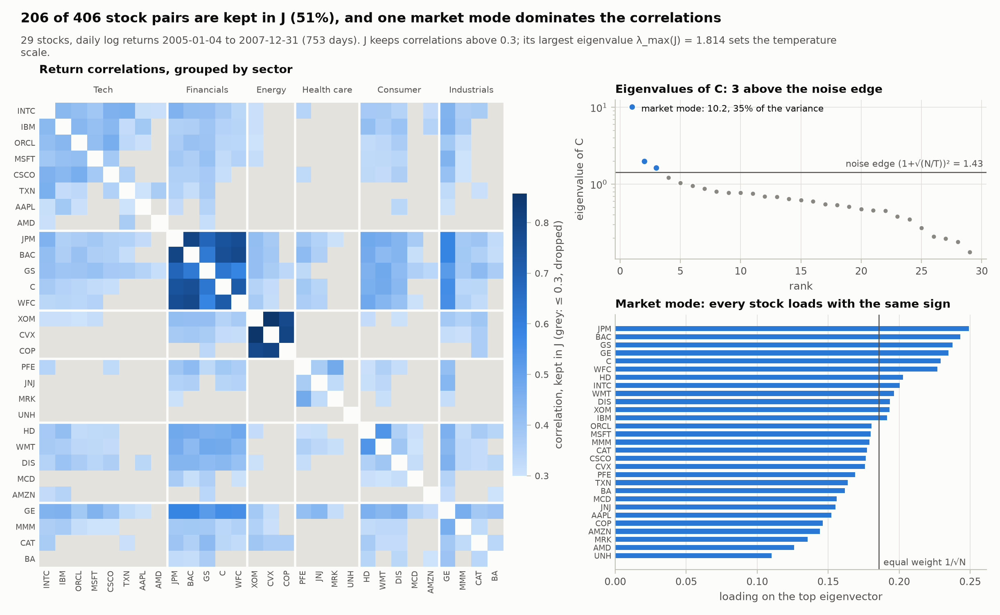
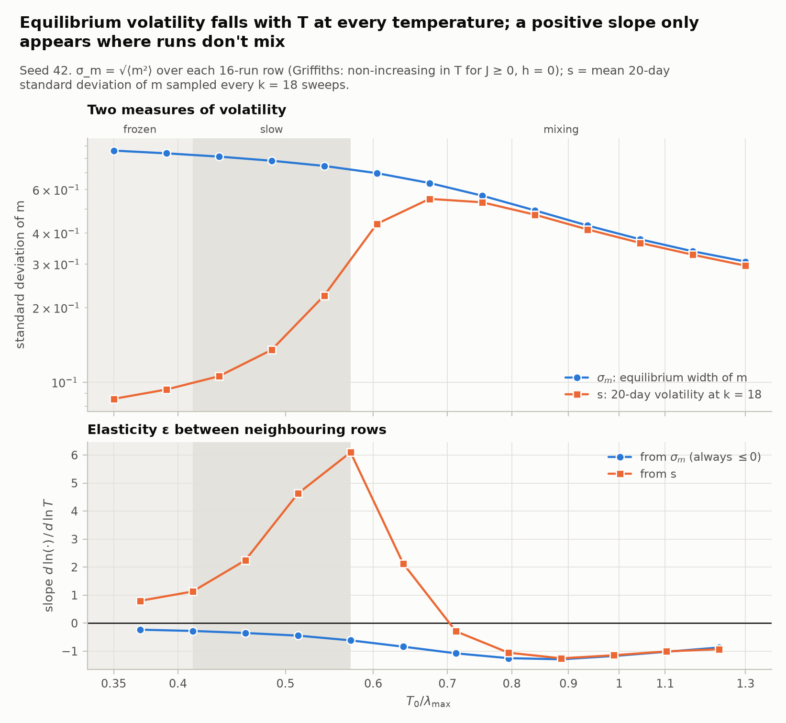
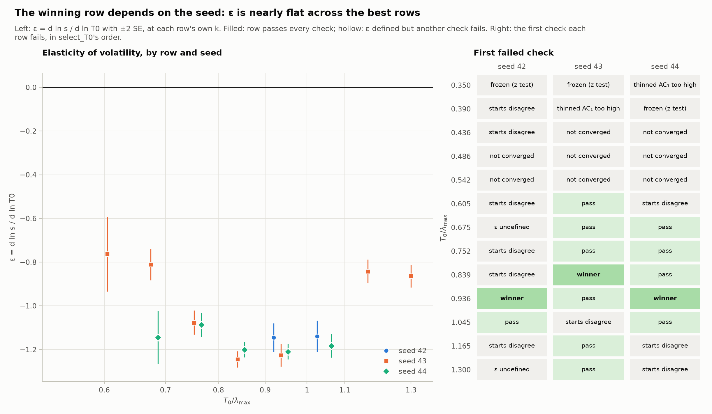
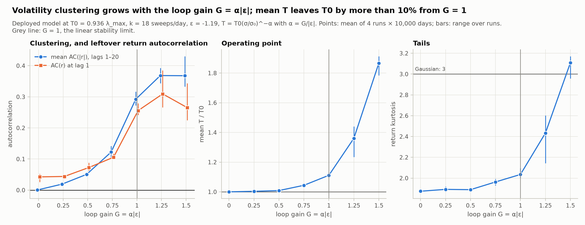
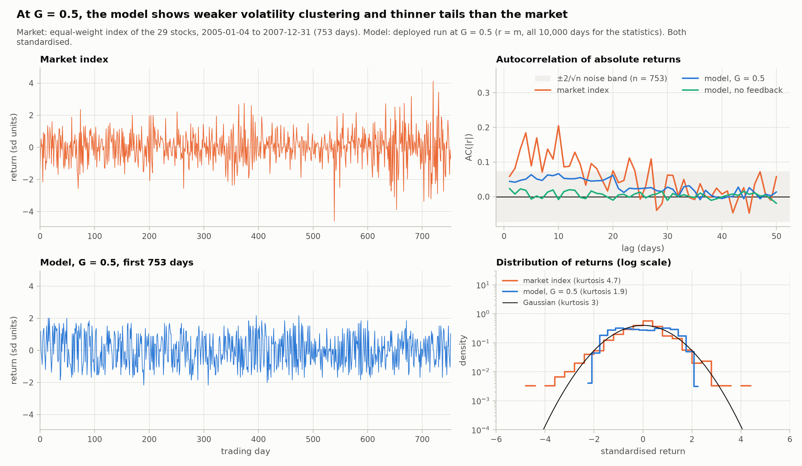

# Financial Ising Model

A statistical-physics model of a stock market. Each of N stocks is an Ising spin (s = +1 buy, −1 sell sentiment), coupled to the others through a network built from empirical return correlations. The spins evolve under single-spin Metropolis dynamics at temperature T, and the market return is proportional to the magnetisation m = Σ s_i / N. A volatility-feedback rule lets recent volatility move the temperature.

The repository contains the model, a calibration pipeline that picks the baseline temperature T0 and the time scale k (Monte Carlo sweeps per trading day) from pilot simulations, and a compiled harness for running the calibrated model and measuring stylised facts.

## Status (October 2026)

- The calibration pipeline runs end to end on real data: 29 US large caps, 2005–2007, from Yahoo Finance.
- The calibrated model with volatility feedback produces volatility clustering on the real network, but the original goal of reproducing fat tails is out of reach in this setup (see *Findings*).
- The figures below are reproduced by `scripts/make_figures.py` from the frozen data.
- The project is moving toward **early-warning signals for regime flips**, using the model as a lab where every flip's timing and cause are known (see *Next steps*).

## Findings so far

All figures come from the frozen 2005–2007 data for 29 stocks; temperatures are quoted as multiples of λ = λ_max(J).

### The data: one market mode and two tight sectors



- **Network.** 753 trading days; J keeps 206 of 406 pairs (50.7%) and λ_max(J) = 1.814. The mean pairwise correlation is 0.32, so the 0.3 cut-off sits right at the typical correlation.
- **One market mode.** It carries 35% of the variance (λ₁ = 10.2), and every stock loads on it with the same sign; financials and GE load most.
- **Little else above noise.** Only two more eigenvalues clear the random-matrix noise edge of 1.43: an energy mode (λ₂ = 2.0) and a financials-versus-tech mode (λ₃ = 1.65).
- **Uneven connectivity.** Financials (average correlation 0.71) and energy (0.81) are the tight blocks; tech averages 0.35 and health care 0.28. UNH has no edges at all.

### The volatility feedback has to lower T when volatility rises



- For ferromagnetic couplings (J ≥ 0) at h = 0, Griffiths' second inequality makes ⟨m²⟩ non-increasing in T. So in any well-mixed run, volatility *falls* as T rises (ε = d ln σ / d ln T ≤ 0).
- **On the real network:**
  - The equilibrium width σ_m falls at every temperature in the scan, from 0.86 to 0.31.
  - The 20-day volatility s rises with T only in rows that don't mix (local slopes up to +6). There it measures fluctuations inside a single well: s/σ_m = 0.10–0.30.
  - From 0.75 λ up, s/σ_m ≈ 0.96 and the two slopes agree.
  - The positive ε the original pipeline required exists only in that artefact.
- **The old rule could only damp.** T = T0(1 + α σ/σ0) therefore could only damp volatility, and it also shifted the operating point above T0.
- **The new rule.** The model now uses **T = T0 (σ/σ0)^(−α)**: higher volatility means lower T, i.e. more herding. The loop gain is G = α|ε|.

### Calibration on real data



- **Three regimes across the T0 scan** ([regime map](docs/figures/fig2_regimes.png), [example runs](docs/figures/fig4_traces.png)):
  - frozen in one well at 0.35–0.39 λ;
  - too slow to converge at 0.44–0.54 λ (τ_int of 500–900 sweeps, against a cap of 167);
  - mixing from 0.60 λ.
- **The clock depends strongly on T0.** One trading day is 432 sweeps at 0.60 λ, 18 at 0.94 λ and 7 at 1.30 λ.
- **The winning row changes with the seed:** 0.936 λ in seeds 42 and 44, 0.839 λ in seed 43.
  - ε lies between −1.08 and −1.25 for every row from 0.75 λ to 1.05 λ, so noise of 0.01–0.03 decides which one wins.
  - The most common failure is the check that random and all-up starts agree: 10 of the 25 failed rows across the three seeds. Seed 42 alone fails it on 6 of 13 rows, 4 of them in the mixing regime.
- **Recommended:** T0 = 0.936 λ = 1.699, k = 18 sweeps/day, σ0 = 0.415, ε = −1.19. It is the only row that passes in all three seeds.

### Deployment on the real network: clustering, with two artefacts



- **Clustering grows with the loop gain** (mean AC(|r|) over lags 1–20):

  | G = α\|ε\| | 0.25 | 0.5 | 0.75 | 1 |
  |---|---|---|---|---|
  | mean AC(\|r\|), lags 1–20 | 0.019 | 0.051 | 0.122 | 0.292 |

- **Stability.** With ε = −1.19, linear stability needs α < 0.84 (G < 1).
  - The operating point holds up to G = 0.75 (mean T/T0 = 1.04).
  - Past G = 1 it runs away: mean T/T0 is 1.11 at G = 1, 1.36 at 1.25 and 1.87 at 1.5.
- **Artefact 1: lag-1 return autocorrelation grows with the clustering.** It is 0.073 at G = 0.5 and 0.26 at G = 1, against −0.10 for the index. Feedback slows the dynamics, so k has to be re-chosen under feedback; on the synthetic test network, doubling k removed it at G = 0.5 and kept the clustering.
- **Artefact 2: the clustering has a fixed memory.** In the model, AC(|r|) is flat out to lag 20 and then drops, because the feedback averages over a 20-day window. The market's AC(|r|) decays gradually instead.

### No fat tails



- **Model vs index.** The equal-weight index of the 29 stocks has kurtosis 4.7 and mean AC(|r|) 0.10. The model at G = 0.5 has kurtosis 1.9 and mean AC(|r|) 0.05; without feedback it shows no clustering at all.
- **Returns ∝ m are capped.** Since |m| ≤ 1, a standardised return can't exceed about 1/σ_m ≈ 2.3 standard deviations at the selected T0, while the index has days beyond 4.
- **m is two-humped even when mixing** ([fig. 4](docs/figures/fig4_traces.png)), which pushes kurtosis below 3. The Binder ratio, which equals the return kurtosis, is 1.17–2.46 across the mixing rows.
- **Kurtosis passes 3 only after runaway**, at G = 1.5, when T has drifted 87% above T0.
- **Part of the index's tails and clustering is one regime shift.** Its daily volatility was 0.65–0.77% in each half-year until mid-2007 and 1.26% from July 2007. Its worst day is 27 February 2007, at −4.5 standard deviations.
- This is a limit of how returns are defined in the model, not of the calibration.

## Repository layout

```
src/ising_market/model.py   model, calibration pipeline, deployment harness
scripts/calibrate_real.py   downloads the data once, freezes it in data/, calibrates seeds 42-44
scripts/make_figures.py     the figures and numbers summary used in this README
docs/figures/               committed copies of the figures
pyproject.toml, uv.lock     dependencies (managed with uv)
```

`data/` and `results/` are git-ignored; regenerate them by rerunning the scripts. A fresh Yahoo download can differ slightly from an earlier one, so keep a frozen copy of the returns for anything you need to reproduce exactly.

## Setup

```bash
uv sync
```

This installs Python 3.12 (see `.python-version`), numpy, scipy, pandas, networkx, matplotlib, numba and yfinance.

## Running the calibration

```bash
uv run python -m ising_market.model
```

This downloads the 30 tickers (TWX fails and is dropped) and builds J. It then runs the T0 scan: 13 temperatures × 8 seeds × 2 starts = 208 pilot runs of 50,000 sweeps each after a 10,000-sweep burn-in. Finally it prints the selection report. The compute part takes about half a minute on a laptop.

The command-line flags (`--mode`, `--alpha`, …) are parsed but not used yet.

## Reproducing the figures

```bash
uv run python scripts/calibrate_real.py   # once: download, freeze data/, calibrate seeds 42-44
uv run python scripts/make_figures.py     # about a minute: results/figures/*.png and summary.md
mkdir -p docs/figures && cp results/figures/fig*.png docs/figures/
```

`make_figures.py` reruns the calibration for seeds 42–44 and picks the row that passes in the most seeds. It then runs the deployed model at seven loop gains (4 runs × 10,000 days each). `--quick` makes shorter runs to check the pipeline; `--replot` redraws from the saved numbers without simulating.

## Using the model from Python

```python
from ising_market.model import (fetch_market_data, build_empirical_J, calibrate_parameters,
                                simulate_deployed, stylised_facts)

rets, tickers = fetch_market_data(["AAPL", "MSFT", "JPM", "XOM"], "2005-01-01", "2008-01-01")  # your list
J, C = build_empirical_J(rets)
cal = calibrate_parameters(rets, J, n_pilot=50_000, n_burn=10_000, seed=42)

if cal["T0"] is not None:
    sim = simulate_deployed(J, cal["T0"], cal["k"], alpha=0.4, sigma0=cal["sigma0"], n_days=10_000)
    print(stylised_facts(sim["r"]))     # kurtosis, JB p-value, t dof, AC(r), AC(|r|)
```

## How the calibration works

1. **Network.** J_ij = corr_ij where corr_ij > 0.3, rescaled so the mean non-zero coupling is 0.1. λ_max(J) sets the scale of the mean-field crossover, and the T0 grid runs from 0.35 λ to 1.30 λ.
2. **Pilot runs** at α = 0 and h = 0, from random and all-up starts, using a compiled (numba) Metropolis kernel.
3. **Per-run statistics:**
   - RMS magnetisation σ_m and Binder ratio R (the return kurtosis, since returns ∝ m);
   - integrated autocorrelation time τ_int, using Sokal's automatic window with c = 6, so a run counts as converged only if τ_int < n/300;
   - a zero-mean z test.
4. **Per-temperature row:**
   - thinning interval k = ⌈3 · p75(τ_int)⌉ over the converged runs;
   - pooled signed lag-1 autocorrelation of the thinned series, which must satisfy |mean| + 2 SE ≤ 0.10;
   - rolling volatility s at k;
   - an equilibration check comparing random and all-up starts.
5. **Elasticity** ε = d ln s / d ln T0, measured at the row's own k. It's an OLS slope over that row and its neighbours, using only rows that pass the run-quality checks.
6. **Selection.** A row must pass every check and have ε + 2 SE < 0; the winner is the row with the most negative upper bound. `calibrate_parameters` returns `T0`, `k` (use as `sweeps_per_step`) and `sigma0`.
7. **Deployment.** k sweeps per day, with T = T0 (σ/σ0)^(−α) updated daily from the standard deviation of the last 20 daily values of m.

## Known limitations

- **The equilibration check is noisy.** It compares 8 runs against 8 with a 2σ test and falsely fails about 30% of well-mixed rows. Together with the flat ε near its optimum, this is why the selected T0 depends on the seed.
- **No fat tails.** Returns ∝ m are bounded (about ±2.3 standard deviations at the selected T0) and two-humped (see *Findings*).
- **Feedback artefacts.** Clustering comes with positive lag-1 return autocorrelation unless k is re-chosen under feedback, and its memory stops at the 20-day window.
- **numba cache.** The on-disk cache is tied to the name the module was imported under. If you import `model.py` both as a top-level `model` and as `ising_market.model`, you'll get `ModuleNotFoundError: No module named 'model'`. Delete the `*.nbi` and `*.nbc` files under `src/` (`find src \( -name "*.nbi" -o -name "*.nbc" \) -delete`), or set `cache=False` (compiling costs under a second per kernel).
- **Unfinished pieces of the old code:**
  - the CLI flags do nothing yet;
  - the `plot_*` helpers predate the calibration: they use one sweep per step and no calibrated σ0;
  - κ is not calibrated (`target_vol` is unused).
- **No tests in the repository yet.** `pyproject.toml` points pytest at `tests/`, which is currently git-ignored.

## Next steps

### 1. Early-warning signals for regime flips (main direction)

The question is when indicators computed from market data can warn of a regime flip, and whether a detector trained on simulations works on real APAC index data. The model can produce each kind of transition with known labels:

- noise-driven tunnelling at fixed T;
- a slow drift in the news field h toward the point where the current state disappears;
- an approach to the critical point;
- a sudden shock.

A pilot on the synthetic network found:
- **No warning for noise-driven flips or shocks:** ROC-AUC 0.50–0.54 for every indicator.
- **Drift-driven flips are detectable, but weaker as the drift slows:** variance AUC goes from 0.96 to 0.79.
- **The strongest signal is a trivial one:** how far m has already sagged toward the barrier (AUC 0.93–0.99).
- **Lag-1 autocorrelation is weak** (≤ 0.64).

So any early-warning claim has to beat a drawdown-style baseline, not just chance.

Planned phases, each ending in a go/no-go check:
1. A simulation lab producing a "warnability map": AUC as a function of drift rate and T, net of the level baseline, reproduced on three networks.
2. Network-resolved indicators: sector magnetisations, the top eigenmode of J, mean pairwise spin correlation.
3. A detector trained on simulations: gradient boosting first, a sequence model only if it does better.
4. A single pre-registered test on APAC index data (Hang Seng, Nikkei, KOSPI, …), with event rules fixed in advance and placebo windows.
5. A write-up.

First concrete steps: load the frozen J; re-pick the pilot temperatures on the real network, where flip rates differ from the synthetic one; then rerun the pilot.

### 2. Calibration loose ends

- Select T0 by pooling seeds (survival frequency and mean ε per row) instead of taking one seed's best row.
- Fix the equilibration test: a Bonferroni threshold across its three statistics, or more seeds per start.
- Re-choose k under feedback before any deployment runs.
- Replace the 20-day volatility window with an EWMA or several windows, so the clustering decays instead of stopping at 20 days.
- Compare the model with the index both with and without the second half of 2007.
- Add pytest tests: bit-identical pilots, FFT autocorrelation matching the direct method, and a seed-pinned calibration snapshot.
- Set `cache=False` on the numba kernels, wire up the CLI, update the `plot_*` helpers, and calibrate κ against index volatility.

### 3. Possible extensions

- Fit couplings by inverse Ising (pseudo-likelihood) instead of thresholding correlations, so the market's own distance from criticality can be estimated.
- Model crashes as avalanches in a driven random-field Ising model, which is a known route to heavy tails.
- Use a kinetic (asymmetric) Ising model to study directed influence across APAC time zones.

## References

- Griffiths, R. B. (1967). Correlations in Ising ferromagnets. I. *J. Math. Phys.* 8, 478.
- Sokal, A. D. (1997). Monte Carlo methods in statistical mechanics: foundations and new algorithms. In *Functional Integration*, Springer (NATO ASI Series).
- Scheffer, M. et al. (2009). Early-warning signals for critical transitions. *Nature* 461, 53–59.
- Ditlevsen, P. D. & Johnsen, S. J. (2010). Tipping points: early warning and wishful thinking. *Geophys. Res. Lett.* https://doi.org/10.1029/2010GL044486
- Guttal, V. et al. (2016). Lack of critical slowing down suggests that financial meltdowns are not critical transitions, yet rising variability could signal systemic risk. *PLoS ONE* 11(1), e0144198. https://doi.org/10.1371/journal.pone.0144198
- Bury, T. M. et al. (2021). Deep learning for early warning signals of tipping points. *PNAS* 118, e2106140118. https://doi.org/10.1073/pnas.2106140118
- Bury, T. (2013). Market structure explained by pairwise interactions. *Physica A* 392(6), 1375–1385. https://arxiv.org/abs/1210.8380

---

<sub>**AI assistance.** A main learning goal of this project was for me to learn how to effectively AI as a research assistant. This project used Claude (Anthropic) as a research assistant. Claude reviewed the calibration code, identified the statistical issues described above, ran diagnostic simulations on a synthetic test network, and drafted code changes, the figure script and documentation. The author reviewed and applied every change, ran the verification checks, the real-data calibration and the figures, and is responsible for the code and conclusions.</sub>